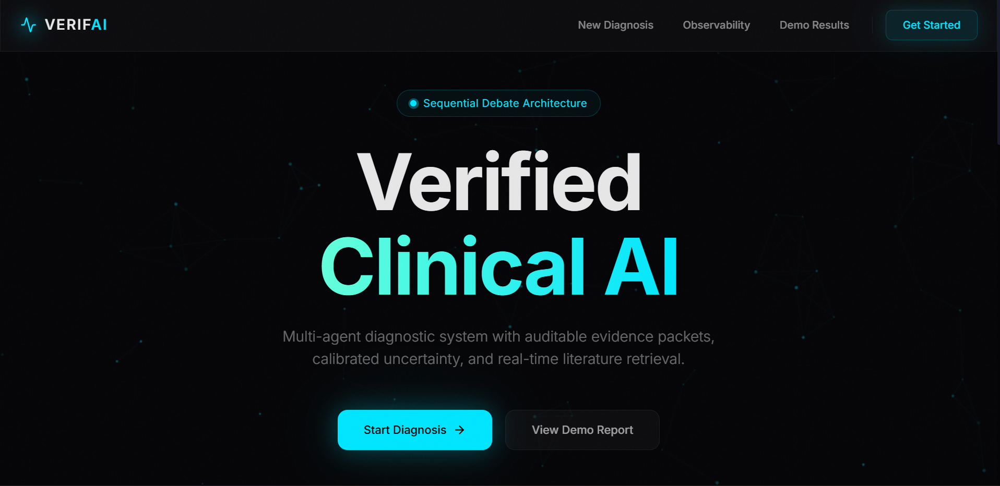
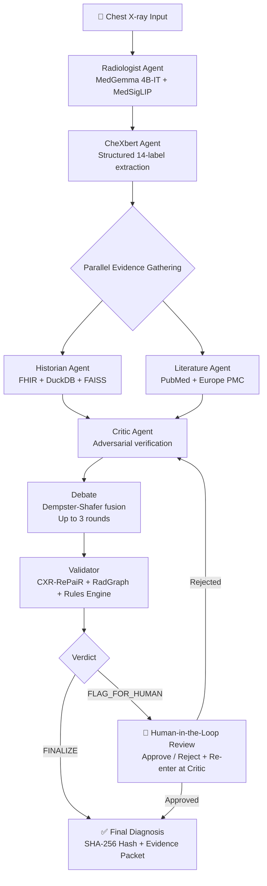
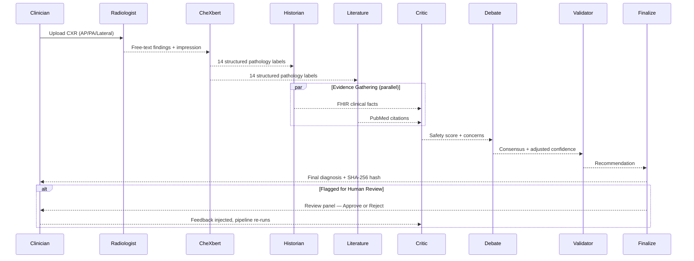
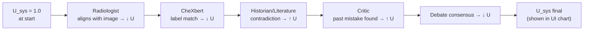
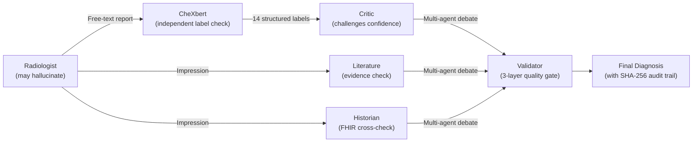

<p align="center">
  
  
  
  
  
  
</p>

# VERIFAI — Verified Evidence-based Radiology Interpretive Framework with Agentic Intelligence

> **A multi-agent AI system for chest X-ray interpretation that produces clinically trustworthy, evidence-backed diagnoses with built-in safety guardrails, adversarial debate, and human-in-the-loop review.**



VERIFAI orchestrates **nine specialized AI agents** through a LangGraph state machine to analyze chest X-rays, cross-reference patient history and medical literature, debate diagnostic uncertainty, and produce auditable diagnoses — all runnable on a **single A100 / 24 GB+ GPU**.

---

## Table of Contents

- [Architecture Overview](#architecture-overview)
- [Agent Pipeline](#agent-pipeline)
- [Monotonic Uncertainty Cascade (MUC)](#monotonic-uncertainty-cascade-muc)
- [Key Features](#key-features)
- [Project Structure](#project-structure)
- [Prerequisites](#prerequisites)
- [Hardware Specification (Sizing Guide)](#hardware-specification-sizing-guide)
- [How VERIFAI Is Optimized](#how-verifai-is-optimized)
- [Installation](#installation)
- [Environment Configuration](#environment-configuration)
- [Running the System](#running-the-system)
- [Building the FHIR + FAISS Retrieval Index](#building-the-fhir--faiss-retrieval-index)
- [Frontend Dashboard](#frontend-dashboard)
- [Observability & Monitoring](#observability--monitoring)
- [Testing](#testing)
- [API Reference](#api-reference)
- [Configuration Reference](#configuration-reference)
- [Technical Design Decisions](#technical-design-decisions)

---

## Architecture Overview



---

## Agent Pipeline

| # | Agent | Role | Model / Tool | Output |
|---|-------|------|-------------|--------|
| 1 | **Radiologist** | Analyze CXR images, generate free-text findings & impression | MedGemma 4B-IT (base) + MedSigLIP fine-tuned classifier + LRP heatmaps | Findings, impression, disease probabilities, attention heatmaps |
| 2 | **CheXbert** | Extract 14 structured pathology labels from the report text | `f1chexbert` BERT model | Present / absent / uncertain per label |
| 3 | **Historian** | Retrieve supporting & contradicting patient history from EHR | DuckDB + FAISS vector search + shared MedGemma | Clinical facts, FHIR resource IDs, clinical summary |
| 4 | **Literature** | Search PubMed / Europe PMC for biomedical evidence | BioPython E-Utilities + Europe PMC REST API | Ranked citations, evidence synthesis |
| 5 | **Critic** | Adversarial validation — detect overconfidence, surface past mistakes | Rule-based analysis + Past-Mistakes FAISS | Safety score, concern flags, uncertainty delta |
| 6 | **Debate** | Multi-round structured debate with Dempster-Shafer fusion | LangGraph orchestration (up to 3 rounds) | Consensus direction, confidence adjustment |
| 7 | **Validator** | Three-layer quality gate before finalizing | MedSigLIP FAISS (visual) + RadGraph NLP + Rules Engine | `FINALIZE` / `FINALIZE_LOW_CONFIDENCE` / `FLAG_FOR_HUMAN` |
| 8 | **Finalize** | Build the final diagnosis with a reproducibility hash | SHA-256 + Pydantic | `FinalDiagnosis` (diagnosis, confidence, hash, evidence packet) |
| 9 | **Human Review** | Doctor approves or rejects with feedback | LangGraph `interrupt()` | Approve → finalize; Reject → re-enter pipeline at Critic |

### Pipeline Sequence



---

## Monotonic Uncertainty Cascade (MUC)

Every agent updates a single shared value `system_uncertainty ∈ [0.05, 0.95]` through Bayesian log-odds updates. This gives the system a live, cascading confidence measure that rises when agents disagree and falls when they confirm each other.

**Core update rule:**

```
IG(k)      = α · confidence(k) + β · alignment(k) + γ · direction(k)
U_sys(k)   = clamp( U_sys(k-1) − IG(k), 0.05, 0.95 )
```

`U_sys` starts at **1.0** (maximum uncertainty) and decreases as confirming evidence arrives. A contradiction (`direction = −1`) or low confidence reduces `IG`, keeping entropy high.



| Agent | Confirming Signal | Contradicting Signal |
|-------|------------------|---------------------|
| Radiologist | High MedSigLIP disease probability | Low classification score |
| CheXbert | Label matches impression | Label absent in free text |
| Historian | FHIR conditions support the diagnosis | Contradicting clinical facts |
| Literature | Evidence corroborates findings | Literature contradicts impression |
| Critic | No overconfidence / no past mistakes | Overconfidence flag raised |
| Debate | All agents reach consensus | Agents violently disagree (K ≥ 0.99) |
| Validator | High visual retrieval similarity + entity match | Entity F1 weak / retrieval consensus mismatch |

The **Debate** stage uses Dempster-Shafer evidence fusion. When agents strongly conflict (K ≥ 0.99), the system remains uncertain rather than picking a winner arbitrarily.

The uncertainty history is streamed live to the frontend and rendered as an SVG line chart in the results page.

---

## Key Features

### Core
- **Multi-Agent Orchestration** — 9 specialized agents coordinated via LangGraph state machine with typed state
- **Multi-View CXR Support** — Accepts AP, PA, and Lateral views simultaneously via `<PA>`, `<AP>`, `<LATERAL>` tokens
- **MUC Uncertainty Framework** — Real-time, bidirectional cascading system entropy across the full pipeline
- **Multi-Agent Debate** — Up to 3 Dempster-Shafer-fused debate rounds before consensus
- **Human-in-the-Loop** — LangGraph interrupt-based doctor review; rejected diagnoses re-enter at the Critic with full context

### Safety & Trust
- **Medical Safety Guardrails** — Rule-based + embedding-based checks for critical finding hallucinations
- **Reproducibility Hash** — SHA-256 fingerprint (image + FHIR + config) for FDA 21 CFR Part 11 audit trail
- **Past Mistakes Memory** — DuckDB HNSW vector index stores rejected diagnoses; Critic retrieves similar past errors via neural re-ranking (temporal recency + clinical relevance scoring)
- **CheXbert Cross-Validation** — Structured labels act as a second-opinion independent of the Radiologist's free text
- **Validator Quality Gate** — Three layers: visual FAISS retrieval (MedSigLIP), RadGraph NLP entity matching, clinical rules engine

### Infrastructure
- **SSE Real-Time Streaming** — Live agent progress streamed from backend to frontend via Server-Sent Events
- **LRP Heatmaps** — Transformer explainability via Chefer et al. (CVPR 2021) Layer-wise Relevance Propagation for MedSigLIP
- **Observability Dashboard** — Prometheus-style metrics (latency, confidence, safety scores, per-agent duration)
- **Evidence Report Generator** — HTML reports with citations, heatmaps, and full audit trail
- **Shared Model Loader** — Historian, Literature, and Critic share a single thread-safe MedGemma 4B instance (~9 GB VRAM total vs ~27 GB otherwise)

---

## Project Structure

```
VERIFAI/
├── agents/                      # AI Agent implementations
│   ├── radiologist/             # MedGemma 4B-IT VLM + MedSigLIP classifier + LRP
│   │   ├── model.py             # Model loading (FP16) + VLM inference
│   │   ├── agent.py             # Radiologist agent logic
│   │   ├── classifier.py        # MedGemmaVisionHead: frozen SigLIP + trainable head
│   │   ├── lrp.py               # Chefer et al. (CVPR 2021) LRP for SigLIP
│   │   └── prompts.py           # Structured JSON generation prompts
│   ├── chexbert/                # CheXbert structured labeling
│   │   ├── agent.py             # Extract 14 CXR condition labels
│   │   └── model.py             # f1chexbert BERT model wrapper + transformers 5.x patch
│   ├── historian/               # FHIR patient history retrieval + clinical reasoning
│   │   ├── agent.py             # DuckDB + FAISS vector search orchestrator
│   │   ├── fhir_client.py       # FHIR R4 resource parser + FAISS retriever
│   │   └── reasoner.py          # Clinical reasoning synthesizer (via shared MedGemma)
│   ├── literature/              # PubMed / Europe PMC search
│   │   ├── agent.py             # Literature search orchestrator
│   │   ├── pubmed_entrez.py     # BioPython E-Utilities wrapper
│   │   ├── europe_pmc.py        # Europe PMC REST API
│   │   └── rate_limiter.py      # Adaptive rate limiter (3 req/s NCBI)
│   ├── critic/                  # Adversarial verification
│   │   ├── agent.py             # Overconfidence detection + past mistakes retrieval
│   │   └── model.py             # Rule-based linguistic certainty analysis
│   ├── debate/                  # Multi-agent debate protocol
│   │   └── agent.py             # 3-round Dempster-Shafer debate
│   ├── validator/               # Final quality gate
│   │   ├── agent.py             # Validator orchestrator
│   │   ├── retrieval_tool.py    # CXR-RePaiR: MedSigLIP FAISS visual retrieval
│   │   ├── radgraph_tool.py     # RadGraph NLP entity matching + transformers 5.x patch
│   │   └── rules_engine.py      # Clinical rules engine
│   └── feedback/                # Doctor feedback handler
│       └── agent.py             # Rejection → re-enter pipeline at Critic
│
├── graph/                       # LangGraph workflow
│   ├── state.py                 # VerifaiState TypedDict + Pydantic models
│   ├── workflow.py              # Full graph + node wrappers + interrupt()
│   └── router.py                # Uncertainty-based routing logic
│
├── app/                         # FastAPI backend
│   ├── main.py                  # App entry point + middleware
│   ├── api.py                   # REST endpoints (start, status, resume, SSE)
│   ├── config.py                # Settings (models, thresholds, feature flags)
│   ├── streaming.py             # SSE event bus
│   └── shared_model_loader.py   # Thread-safe MedGemma singleton
│
├── frontend/                    # Next.js 14 dashboard (TypeScript + Tailwind CSS)
│   └── src/app/
│       ├── page.tsx             # Landing page — "The Council"
│       ├── diagnose/page.tsx    # Upload X-ray + start workflow
│       ├── results/[id]/page.tsx # Live results + SSE agent feed + HITL review
│       └── observability/page.tsx # Metrics dashboard
│
├── db/                          # Database layer
│   ├── logger.py                # Session-scoped structured logging (SQLite & Supabase)
│   ├── connection.py            # SQLite connection pool + schema
│   ├── adapter.py               # Database adapter (sqlite / supabase)
│   ├── past_mistakes.py         # Past Mistakes DB (DuckDB + HNSW vector)
│   └── rerank_mistakes.py       # Neural re-ranking (temporal decay + clinical relevance)
│
├── uncertainty/                 # MUC framework
│   ├── muc.py                   # Monotonic Uncertainty Cascade (Information Gain)
│   └── kle.py                   # KL-divergence Epistemic uncertainty
│
├── safety/                      # Medical safety guardrails
│   └── guardrails.py
│
├── monitoring/                  # Observability
│   └── metrics.py               # Prometheus-style counters + histograms
│
├── utils/
│   ├── evidence_report.py       # HTML evidence report generator
│   └── inference.py             # Robust JSON extraction from LLM output
│
├── tests/
│   ├── test_workflow.py         # Primary end-to-end integration test
│   └── ...                      # Additional unit tests
│
├── scripts/
│   ├── build_retrieval_index.py # Build FAISS index from MIMIC-CXR
│   ├── install_radgraph_model.py# RadGraph model first-time setup
│   └── seed_pb.py               # Seed past mistakes database
│
├── train_classifier.py          # MedSigLIP classifier training
├── qlora_medgemma.py            # QLoRA fine-tuning pipeline (optional)
└── docs/
    └── PRINCIPLED_UNCERTAINTY.md # Full MUC derivation
```

---

## Prerequisites

| Requirement | Minimum | Recommended |
|-------------|---------|-------------|
| **Python** | 3.10 | 3.10 |
| **CUDA** | 12.1 | 12.6 |
| **GPU VRAM** | 24 GB | 80 GB (A100) |
| **RAM** | 32 GB | 64 GB |
| **Disk** | 30 GB | 60 GB |
| **Node.js** | 18 | 20+ |
| **OS** | Ubuntu 22.04 | Ubuntu 22.04+ |

**Required accounts:**
- [Hugging Face](https://huggingface.co/settings/tokens) — Token for gated models (`google/medgemma-1.5-4b-it`, `google/medsiglip-448`)
- [NCBI](https://www.ncbi.nlm.nih.gov/account/settings/) — API key for PubMed access (recommended)
- (Optional) [Supabase](https://supabase.com) — For cloud database logging

---

## Hardware Specification (Sizing Guide)

Use this as a practical sizing guide for different usage modes.

| Workload | GPU | CPU | RAM | Disk | Notes |
|----------|-----|-----|-----|------|-------|
| **Smoke test / wiring check** (`MOCK_MODELS=True`) | None | 4+ cores | 8-16 GB | 10+ GB | Fastest way to validate API + workflow wiring without downloading model weights. |
| **Local inference (single user)** | 1x NVIDIA GPU with **24 GB VRAM** (RTX 4090 / RTX 3090 / L4) | 8+ cores | 32 GB | 30+ GB SSD | Enough for full 9-agent flow with shared model loading. |
| **Team demo / repeated runs** | 1x NVIDIA GPU with **40-48 GB VRAM** (A100 40G / L40S / RTX 6000 Ada) | 12+ cores | 64 GB | 80+ GB NVMe SSD | Better headroom for concurrent workflows, larger caches, and lower latency spikes. |
| **Production-like deployment** | 1x A100 80G (or equivalent) | 16+ cores | 64-128 GB | 150+ GB NVMe SSD | Recommended for stable multi-session serving and observability. |
| **Optional fine-tuning (QLoRA script)** | 1x 24-48 GB VRAM (depends on batch/sequence config) | 16+ cores | 64+ GB | 200+ GB NVMe SSD | Training is optional and separate from normal inference runtime. |

### Hardware Notes

- GPU is the primary bottleneck. If VRAM is limited, keep `ENABLE_LLM_CRITIC=False` and run one workflow at a time.
- NVMe SSD significantly improves startup/retrieval responsiveness vs HDD/SATA SSD.
- For Windows hosts, prefer running the stack inside WSL2 + CUDA for best compatibility with Linux-first ML dependencies.

---

## How VERIFAI Is Optimized

VERIFAI uses several concrete runtime optimizations to keep memory use and latency manageable:

1. **Shared MedGemma singleton across agents**
  Historian, Literature, and LLM Critic reuse one shared MedGemma instance via a thread-safe loader, avoiding duplicate model copies in VRAM.

2. **Mixed precision for inference**
  Models are loaded in `bfloat16`/`float16` on CUDA where supported, reducing memory pressure and improving throughput compared with `float32`.

3. **Low-memory model loading path**
  MedGemma uses `low_cpu_mem_usage=True` during loading to reduce CPU RAM spikes during initialization.

4. **Parallel evidence gathering**
  Historian (FHIR) and Literature (PubMed/Europe PMC) run in parallel when `USE_PARALLEL_AGENTS=True`, lowering end-to-end workflow time.

5. **Hybrid retrieval stack (DuckDB + FAISS)**
  Structured filtering is done in DuckDB, semantic similarity ranking is done in FAISS, and indexes are prebuilt to avoid recomputing embeddings during runtime.

6. **Inference-only execution paths**
  Core inference code uses no-grad/inference-mode patterns to avoid autograd overhead and unnecessary memory allocations.

7. **Feature flags for performance control**
  Runtime switches allow trading quality vs speed/resource use:
  - `MOCK_MODELS=True`: no GPU/model download path
  - `ENABLE_LLM_CRITIC=False`: skip extra semantic critic pass
  - `USE_PARALLEL_AGENTS=True`: parallel evidence retrieval
  - `DEBATE_MAX_ROUNDS`: cap debate iterations

### Quick Tuning Tips

- On 24 GB GPUs, keep `ENABLE_LLM_CRITIC=False` for stable memory headroom.
- If latency matters more than recall, reduce `DEBATE_MAX_ROUNDS` from `3` to `1-2`.
- Set `PYTORCH_CUDA_ALLOC_CONF=expandable_segments:True` to reduce CUDA allocator fragmentation in long sessions.

---

## Installation

### 1. Clone the Repository

```bash
git clone https://github.com/your-org/VERIFAI.git
cd VERIFAI
```

### 2. Set Up Conda Environment

```bash
conda create -n verifai python=3.10 -y
conda activate verifai
```

### 3. Install PyTorch with CUDA

```bash
pip install torch torchvision torchaudio --index-url https://download.pytorch.org/whl/cu121

# Verify CUDA
python -c "import torch; print(f'CUDA: {torch.cuda.is_available()}, GPU: {torch.cuda.get_device_name(0)}')"
```

### 4. Install Python Dependencies

```bash
pip install -r requirements.txt
```

### 5. Install NLTK Data

```bash
python -c "import nltk; nltk.download('punkt'); nltk.download('punkt_tab')"
```

### 6. Install RadGraph Model (for NLP validation)

```bash
python scripts/install_radgraph_model.py
```

> RadGraph will auto-download from Hugging Face on first use if the local path is not found.

### 7. Install Frontend

```bash
cd frontend
npm install
cd ..
```

---

## Environment Configuration

```bash
cp .env.example .env
```

Edit `.env` with your values:

```env
# ── Required ──────────────────────────────────────────────────────
HUGGINGFACE_TOKEN=hf_your_token_here    # MedGemma/MedSigLIP access

# ── PubMed (Recommended) ──────────────────────────────────────────
NCBI_EMAIL=your.email@example.com       # Required by NCBI policy
NCBI_API_KEY=your_ncbi_key              # Enables 10 req/s (vs 3 req/s)

# ── Database ──────────────────────────────────────────────────────
DATABASE_MODE=sqlite                    # Use sqlite for local / supabase for cloud

# ── Models ────────────────────────────────────────────────────────
MEDGEMMA_4B_MODEL=google/medgemma-1.5-4b-it
MEDSIGLIP_BASE_MODEL=google/medsiglip-448
MEDSIGLIP_WEIGHTS_PATH=medsiglip_full_model.pt   # Local fine-tuned classifier weights

# ── Optional: Supabase Cloud DB ───────────────────────────────────
SUPABASE_URL=https://xxx.supabase.co
SUPABASE_KEY=your_anon_key
SUPABASE_SERVICE_KEY=your_service_key

# ── Optional: Semantic Scholar ────────────────────────────────────
SEMANTIC_SCHOLAR_API_KEY=your_key

# ── Optional: Workflow Flags ──────────────────────────────────────
MOCK_MODELS=False       # True = skip model download, use mocks (no GPU needed)
ENABLE_LLM_CRITIC=False # Extra MedGemma semantic critic pass (slower)
```

> Set `MOCK_MODELS=True` for a first run to verify the pipeline wiring before downloading model weights.

---

## Running the System

### Quick Start — Full Pipeline Test (No Frontend)

```bash
conda activate verifai
export CUDA_VISIBLE_DEVICES=0
export PYTORCH_CUDA_ALLOC_CONF=expandable_segments:True

python tests/test_workflow.py
```

This runs all 9 agents on a sample chest X-ray and prints:
- Radiologist findings & impression
- CheXbert structured labels
- Critic safety assessment
- Debate consensus
- Final diagnosis with confidence & reproducibility hash
- Full audit trace

### Start Full Stack (Backend + Frontend)

```bash
# Terminal 1 — Backend
conda activate verifai
export CUDA_VISIBLE_DEVICES=0
python -m uvicorn app.main:app --host 0.0.0.0 --port 8000

# Terminal 2 — Frontend
cd frontend
npm run dev
# → http://localhost:3000
```

### API Only (cURL)

```bash
# Start workflow
curl -X POST http://localhost:8000/api/v1/workflows/start \
  -F "images=@chest_xray_AP.jpg" \
  -F "views=AP" \
  -F "patient_id=patient-123"

# Response:
# {"session_id": "abc-123"}

# Poll status
curl http://localhost:8000/api/v1/workflows/abc-123/status

# Subscribe to live SSE progress
curl -N http://localhost:8000/api/v1/workflows/abc-123/stream
```

---

## Models Used

| Model | Source | Purpose |
|-------|--------|---------|
| **MedGemma 4B-IT** | `google/medgemma-1.5-4b-it` (HuggingFace, gated) | Primary VLM for Radiologist, Historian, Literature synthesis |
| **MedSigLIP** | `google/medsiglip-448` (HuggingFace, gated) + local `medsiglip_full_model.pt` | Fine-tuned disease classifier + visual FAISS retrieval |
| **CheXbert (f1chexbert)** | `f1chexbert` pip package | 14-label structured pathology labeling |
| **RadGraph** | Auto-downloaded from HuggingFace | Clinical NLP entity extraction for Validator |
| **all-MiniLM-L6-v2** | `sentence-transformers/all-MiniLM-L6-v2` | Semantic embeddings for FHIR retrieval + Critic |

> **MedGemma is used as the BASE model (no LoRA adapters).** The fine-tuned MedSigLIP classifier (`medsiglip_full_model.pt`) must be placed at the path specified by `MEDSIGLIP_WEIGHTS_PATH` in `.env`.

---

## Building the FHIR + FAISS Retrieval Index

The Historian agent uses a FAISS vector index over patient FHIR records for semantic retrieval.

### Step 1: Extract FHIR Bundles to DuckDB

```bash
python extract_fhir_to_duckdb.py \
  --fhir_dir path/to/fhir/bundles \
  --output verifai_fhir.duckdb
```

### Step 2: Build FAISS Index

```bash
python scripts/build_retrieval_index.py \
  --duckdb_path verifai_fhir.duckdb \
  --output_faiss verifai_fhir.faiss \
  --output_mapping verifai_fhir_mapping.json
```

This produces:
- `verifai_fhir.faiss` — Vector index for fast similarity search
- `verifai_fhir_mapping.json` — Maps FAISS IDs to FHIR resource IDs
- `verifai_fhir.duckdb` — Structured patient data for SQL queries

### Step 3: (Optional) Seed Past Mistakes Database

```bash
python scripts/seed_pb.py
```

---

## Frontend Dashboard

The frontend is a **Next.js 14** app (TypeScript + Tailwind CSS) with a premium dark-themed clinical interface.

### Pages

| Route | Description |
|-------|-------------|
| `/` | Landing page — "The Council" of 6 agents |
| `/diagnose` | Upload CXR + optional FHIR report + patient ID |
| `/results/[session_id]` | Live SSE agent feed → final diagnosis with evidence tabs |
| `/observability` | System metrics dashboard (auto-refreshes every 15s) |

### Results Page Tabs

| Tab | Content |
|-----|---------|
| **Visual Proof** | Original DICOM + MedSigLIP LRP heatmap side-by-side |
| **Clinical** | FHIR supporting & contradicting facts from Historian |
| **Literature** | PubMed citations with relevance summaries |
| **Safety** | Safety guardrails report (score, flags, critical findings) |
| **Audit Trail** | SHA-256 hash + full execution trace |

### Human-in-the-Loop Panel

When the Validator flags a case for human review, a **Human-in-the-Loop** panel appears on the results page. The clinician can:
- **Approve** the diagnosis — marks the workflow as completed
- **Provide Feedback + Rerun** — injects clinical notes, re-runs the pipeline from the Critic with a live SSE feed showing the rerun progress

---

## Observability & Monitoring

```bash
# Metrics snapshot (JSON)
curl http://localhost:8000/api/v1/metrics/summary
```

Returns:
- `system` — total workflows, active, deferrals, critical findings
- `agents` — per-agent latency (mean, p95, p99), invocation counts
- `diagnostics` — confidence, uncertainty, safety score distributions, debate rounds
- `safety` — safety flags, errors by component

Visual dashboard available at `http://localhost:3000/observability`.

When running via `test_workflow.py`, metrics are saved to `metrics_snapshot.json` and automatically served by the API.

### Database Logging

| Mode | When to use | Tables |
|------|-------------|--------|
| `DATABASE_MODE=sqlite` | Local testing | SQLite at `verifai_logs.db` |
| `DATABASE_MODE=supabase` | Production / cloud | Supabase PostgreSQL (see `db/supabase_schema.sql`) |

Key tables: `workflow_sessions`, `agent_invocations`, `radiologist_logs`, `critic_logs`, `historian_logs`, `debate_logs`, `validator_logs`, `doctor_feedback`, `past_mistakes`.

---

## Testing

```bash
# Full end-to-end integration test (recommended first test)
conda activate verifai
export CUDA_VISIBLE_DEVICES=0
python tests/test_workflow.py

# Unit tests
pytest tests/ -v

# Frontend build verification
cd frontend && npx next build
```

---

## API Reference

| Method | Endpoint | Description |
|--------|----------|-------------|
| `POST` | `/api/v1/workflows/start` | Upload image(s) + FHIR data, start async workflow |
| `GET` | `/api/v1/workflows/{id}/status` | Poll workflow status + results |
| `GET` | `/api/v1/workflows/{id}/stream` | SSE stream for live agent progress |
| `POST` | `/api/v1/workflows/{id}/resume` | Submit doctor feedback (approve / reject) |
| `POST` | `/api/v1/safety/validate` | Run safety guardrails on a diagnosis string |
| `GET` | `/api/v1/metrics/summary` | Observability metrics |
| `GET` | `/api/v1/health` | Server health check |
| `POST` | `/api/past-mistakes/insert` | Insert a validated diagnostic mistake |
| `POST` | `/api/past-mistakes/search` | Search for similar past mistakes |
| `GET` | `/api/past-mistakes/statistics` | Aggregate past-mistakes statistics |

### Example: Start Workflow

```bash
curl -X POST http://localhost:8000/api/v1/workflows/start \
  -F "images=@chest_xray_AP.jpg" \
  -F "images=@chest_xray_LAT.jpg" \
  -F "views=AP" \
  -F "views=LATERAL" \
  -F "patient_id=patient-123" \
  -F "fhir_report=@patient_fhir_bundle.json"
```

### Example: Status Response

```json
{
  "session_id": "abc-123",
  "status": "completed",
  "final_result": {
    "diagnosis": "Right lower lobe pneumonia with associated pleural effusion",
    "confidence": 0.87,
    "reproducibility_hash": "a3f9c2e1b7d4082f...",
    "evidence_packet": { "...": "..." },
    "trace": ["[RAD] Findings generated", "[CHEXBERT] 3 labels found", "..."]
  }
}
```

---

## Configuration Reference

All settings live in `app/config.py` and can be overridden via `.env`:

### Models

| Variable | Default | Description |
|----------|---------|-------------|
| `MEDGEMMA_4B_MODEL` | `google/medgemma-1.5-4b-it` | Base MedGemma model (no LoRA) |
| `MEDSIGLIP_BASE_MODEL` | `google/medsiglip-448` | Vision encoder backbone |
| `MEDSIGLIP_WEIGHTS_PATH` | `medsiglip_full_model.pt` | Local fine-tuned classifier checkpoint |
| `TEXT_EMBEDDING_MODEL` | `sentence-transformers/all-MiniLM-L6-v2` | Semantic embeddings |
| `MOCK_MODELS` | `False` | Skip real models, use mocks |

### Workflow

| Variable | Default | Description |
|----------|---------|-------------|
| `DATABASE_MODE` | `sqlite` | `sqlite` (local) or `supabase` (cloud) |
| `DEBATE_MAX_ROUNDS` | `3` | Maximum debate rounds |
| `DEBATE_CONSENSUS_THRESHOLD` | `0.15` | Max disagreement delta for consensus |
| `MAX_ROUTING_STEPS` | `5` | Prevent infinite routing loops |
| `ENABLE_LLM_CRITIC` | `False` | Enable MedGemma semantic critic pass |
| `ENABLE_PAST_MISTAKES_MEMORY` | `True` | Historical error retrieval at Critic |
| `ENABLE_DOCTOR_FEEDBACK` | `True` | Enable feedback reprocessing loop |
| `USE_DEBATE_WORKFLOW` | `True` | Enable multi-agent debate |
| `USE_PARALLEL_AGENTS` | `True` | Run Historian + Literature in parallel |

### API Keys

| Variable | Required | Description |
|----------|----------|-------------|
| `HUGGINGFACE_TOKEN` | ✅ | Access gated HuggingFace models |
| `NCBI_EMAIL` | ✅ | PubMed API policy requirement |
| `NCBI_API_KEY` | Recommended | Higher rate limits (10 req/s) |
| `SEMANTIC_SCHOLAR_API_KEY` | Optional | Semantic Scholar access |
| `SUPABASE_URL` / `SUPABASE_KEY` | Optional | Cloud database logging |

---

## Technical Design Decisions

### Why Multi-Agent (Not a Single Model)?

A single LLM producing diagnoses has no internal checks — it can hallucinate confidently. VERIFAI uses structured adversarial verification:



Each agent provides an independent, adversarial check on the previous. No single model can silently propagate a hallucination through all layers.

### Why LangGraph?

- **Typed state** (`TypedDict`) shared across all agents — no message-passing overhead
- **Checkpointing** — workflow can be interrupted and resumed mid-run (critical for human review)
- **Deterministic routing** — graph edges, not LLM-decided next steps
- **Thread safety** — concurrent workflows with fully isolated state

### Why Reproducibility Hash?

FDA 21 CFR Part 11 requires electronic records to be auditable. The SHA-256 hash encodes which image was analyzed, what patient context was used, what model versions were active, and what configuration was set at the time of diagnosis. This provides provenance — not exact reproduction (LLMs are stochastic, but the context that produced the output is traceable).

---

## License

This project is for research and educational purposes. Clinical deployment requires regulatory review and validation.
